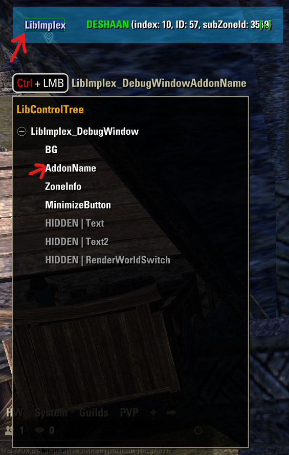
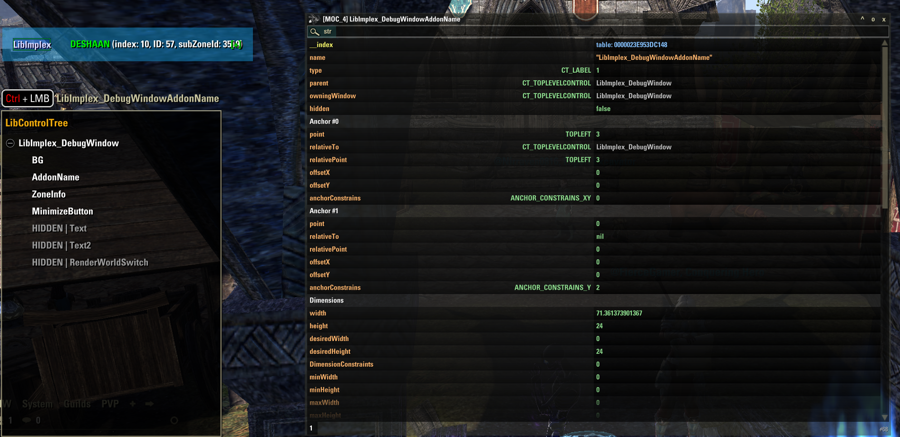
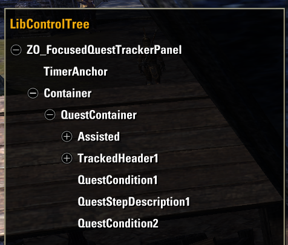

# LibControlTree

Simple tool to examine controls structure (tree) 🌳

### What is can do so far

> TLC = top level control (anchored to GuiRoot)

- Move mouse over control (it will become highligted) and press `Ctrl + LMB` to open it's TLC in tree view

- Move mouse over leaves to see them higlighted

- You can now press `Ctrl + LMB` to open it in merTorchbug (should be installed separately)

- You can expand/collapse controls to see their child controls

